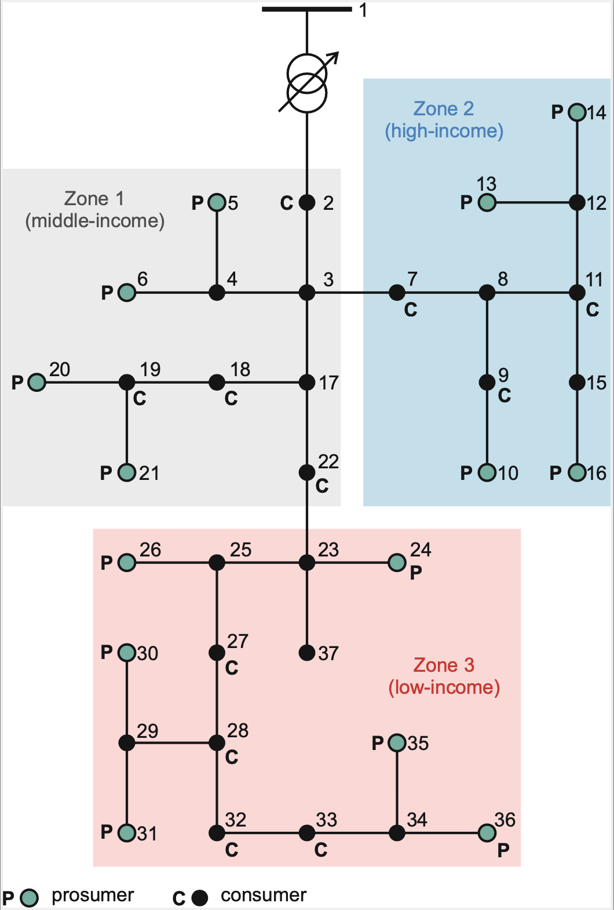

## Tariff and Socioeconomic Factors in Equilibrium Analysis of DER Investments

Codes developed by Miguel Sanchez-Lopez during his PhD thesis in the Universidad de Chile and the University of Manchester. Supervised by Rodrigo Moreno, Robin Preece and Eduardo Martinez-Ceseña.

## Table of Contents
- [Installation](#installation)
- [Usage](#usage)
- [Contact](#contact)

## Installation
The codes are executed with Python 3.11. To install the required dependencies, run:

```sh
pip install -r requirements.txt 
```
Additionally, the optimiser is Gurobi v11.0.0 used with academic licence

## Usage
The current case of study can be executed through the script Run_models_2.py

Current case of study is given by the following network 

- Scheme of the modelled network:  
  ```md


Figures can be created from Tariff_comparison.py. However current results are hardcoded.

## Contact
For doubts and suggestion, please, contact miguel.sanchezlopez@eng.ox.ac.uk
